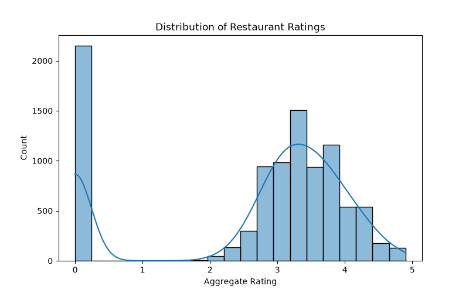
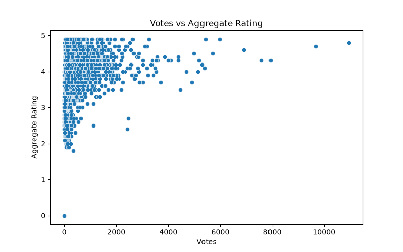
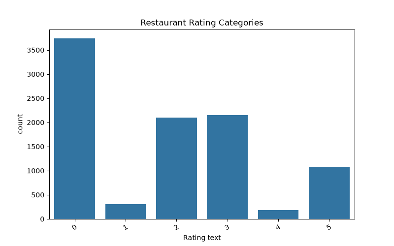
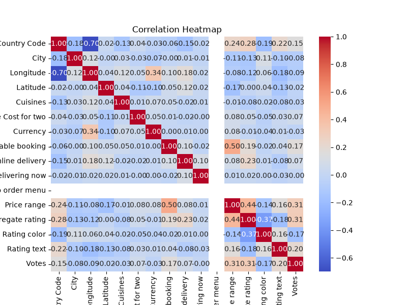
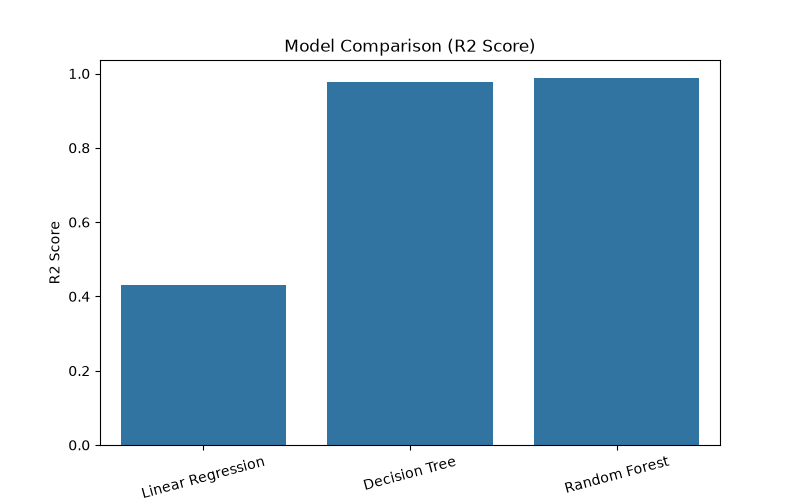

# 🍽️ Restaurant Rating Prediction

## 📌 Project Overview

This project was developed as part of the **Cognifyz Technologies Machine Learning Internship**.

The objective is to predict restaurant ratings using machine learning algorithms based on restaurant information such as location, cuisines, votes, and other features.

---

## 📂 Dataset

The dataset contains restaurant information including:

- Restaurant Name
- Country Code
- City
- Cuisines
- Average Cost
- Price Range
- Votes
- Rating Text
- Aggregate Rating

---

## 🛠 Technologies Used

- Python
- Pandas
- NumPy
- Matplotlib
- Seaborn
- Scikit-learn

---

## 📊 Project Workflow

1. Data Loading
2. Data Exploration (EDA)
3. Data Cleaning
4. Label Encoding
5. Feature Selection
6. Train/Test Split
7. Model Training
8. Prediction
9. Model Evaluation
10. Data Visualization
11. Model Comparison

---

## 🤖 Machine Learning Models

- Linear Regression
- Decision Tree Regressor
- Random Forest Regressor

---

## 📈 Model Performance

| Model | R² Score |
|--------|----------|
| Linear Regression | 0.4307 |
| Decision Tree | 0.9762 |
| Random Forest | **0.9872** |

Random Forest achieved the best performance among all models.

---

## 📷 Visualizations

The project generates:

- Rating Distribution
- Votes vs Rating
- Rating Categories
- Correlation Heatmap
- Model Comparison Chart

---

## ▶️ How to Run

Install the required libraries:

```bash
pip install -r requirements.txt
```

Run the project:

```bash
python task1_rating_prediction.py
```

---

## 📁 Project Structure

```
Restaurant-ML/
│
├── Dataset.csv
├── task1_rating_prediction.py
├── requirements.txt
├── README.md
├── rating_distribution.png
├── rating_categories.png
├── votes_vs_rating.png
├── correlation_heatmap.png
└── model_comparison.png
```

---
## Results

### Rating Distribution


### Votes vs Rating


### Rating Categories


### Correlation Heatmap


### Model Comparison


## 👩‍💻 Author

**Nada Mohammad**

Machine Learning Intern at Cognifyz Technologies